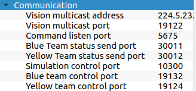

CRAbE - Central AI of NAMeC

## Requirements
To run the project, you will need the [Rust](https://www.rust-lang.org/tools/install) compiler.

## How to run ?

Clone the project and build it using `cargo`

```bash
git clone git@github.com:NAMeC-team/CRAbE.git
cd CRAbE/
cargo build
```

Check the available arguments by passing the argument `-h` to the binary (and not cargo)
```bash
cargo run -- -h
```

### Simulator
There are two official league simulators that are available to all teams.
To get started, we recommend using the grSim simulator, that you can download [here](https://github.com/RoboCup-SSL/grSim).

The simulator sends multicast packets on the network, so you need to be connected to a network (Internet is not required) so
that the simulator can bind itself to a multicast IP address.

Install & run the simulator in the background, then open a terminal and check that vision data can be correctly received
```bash
cargo run --bin vision_log
```
If you see a continuous stream of text being displayed on the terminal, the vision is correctly configured.

You can change the ports on which data is sent or received.
There is a single caveat with sending commands : if you want to send commands to the yellow team,
you need to specify the `--simulator-port` and give it the value of "Yellow team control port" in grSim,
and add the `-y` option with the binary.


In this example, you would run the following command :
```bash
# yellow team
cargo run -- -y --simulator-port=19124

# blue team
carog run -- --simulator-port=19132
```

You can change on which ports data is sent or received for the vision sytem, the game controller etc..
Run `cargo run -- -h`to see the arguments available

### Real setup
A guide is available on the main computer of NAMeC's SSL room.

## Modules
- crabe

Main pipeline of the software

- crabe_filter

Filters and interprets data received from external systems (such as the vision),
and puts the translated data into the `world` variable.
The module is divided in 3 distinct parts 

1. pre_filter/

Translates Protobuf packets into their respective data

2. filter/

Applies modifications to the data

3. post_filter/

Inteprets filtered data and modifies the `world` variable

- crabe_framework

Definition of structures and types used throughout the project

- crabe_guard

Used to impose a limit on output commands, such as limiting the target speed of a command.

- crabe_io

Input/Output handling.
Contains binaries to test correct reception of data from external systems

Manages vision reception, emission of commands to the mainboard, and emissoin of data to the viewer.

- crabe_math

- crabe_navigation

- crabe_protocol
Protobuf packets and their Rust files version generated by prost.

