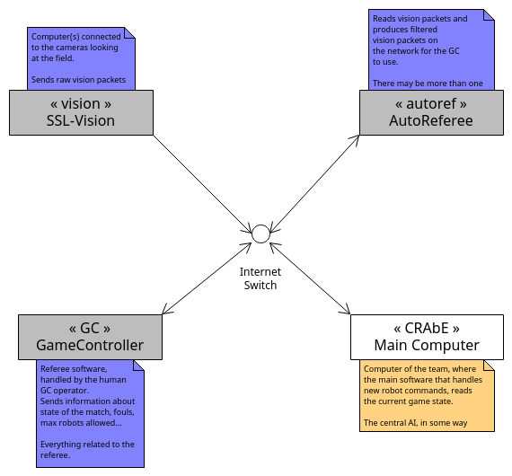
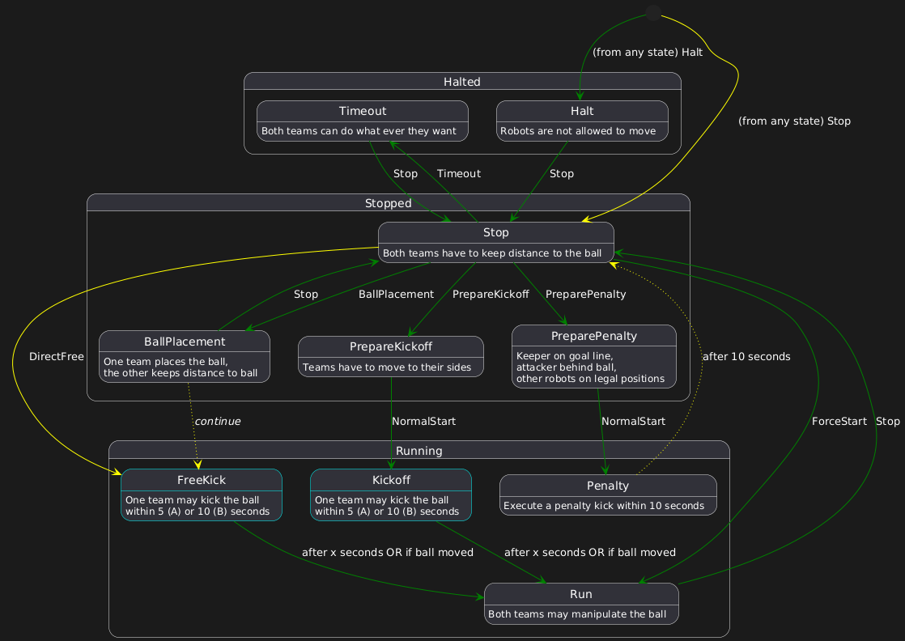

# GC state machine implementation
This file explains how we implemented the parsing of states emitted by the Game Controller.
It goes over how an SSL match is played, and the different external modules in action
during the match.

## Introduction
An SSL match is composed of three external systems : the vision system, the Game Controller (referred to as GC) and the AutoReferee.
We do not implement those, they are made available to all SSL teams, and refereed to as "league software".
In every setup, their data is made available on an Internet work, often using Ethernet cables.
Here is a (ugly but functional) drawing to get the idea.



The vision system provides visual data about the position of the robots, their orientation and cetera.

The Game Controller is a human-commanded software responsible for handling the different states of the match.
It is controlled by the GC operator in the match, who talks with the human referee to take decisions
on the state of the match.

Briefly, a match can be in three main states :
- Halted : no robts are allowed to move
- Stopped : robots may move but must keep a certain speed and stay away from the ball
- Running : the game is normally running

The AutoReferee is a software that communicates with the GC and provides filtered vision data.
It is also the one raising the possible fouls in the game. There may be multiple AutoRefs online.

For more information about the software in the league, you should read the [SSL rulebook, section 2.3](https://robocup-ssl.github.io/ssl-rules/sslrules.pdf).

## Reading the state machines
The rulebook [defines](https://robocup-ssl.github.io/ssl-rules/sslrules.pdf#%5B%7B%22num%22%3A581%2C%22gen%22%3A0%7D%2C%7B%22name%22%3A%22XYZ%22%7D%2C0%2C381.41%2Cnull%5D)
an almost-complete state machine describing the possible states of the match.

This diagram cannot be implemented as such, because of some phantom transitions, and also missing ones.
But it helps to understand it as an explanation of the transitions happening in a match.

To implement it, the state diagram has been redrawn to include all possible transitions.
Here is the legend for the different colors (taken directly from `ssl_statemachine_explciited.puml`) :

```
'Legend
' - Yellow filled line : New transition from original document
' - Yellow dotted line : transition not implemented
' - Green line : implemented
' - Aqua outline : dynamic state
```



There is [another version](./ssl_statemachine_implemented.puml) of this file, without the phantom transitions and the colors.

We will go through all interpretations made in this document.
Note that all "interpretations" are merely just using the Game Controller software
and looking at what it actually sends.

## Phantom transitions
The yellow dotted lines represent transitions that were in the original document, but were not implemented.
These "phantom" transitions are only here to explain how the game progresses.

Take for instance the transition `BallPlacement -> FreeKick` :
Ball placement is an action that is not mandatory in Division B, teams may or may not perform it during the match.
If none of the two teams perform it, here is the chain of events :
1. "Stop" command is issued (by the GC)
2. The human referee places the ball at the required location
3. "FreeKick" command is issued
4. The free kick is performed in the match

In the case where one team does perform ball placement during the match,
the GC will send the "BallPlacement" command instead.
Whether ball placement fails or succeeds, the GC will first send a "Stop" command
then send the "DirectFree" command to actually start the free kick.
The resulting chain of events is `BallPlacement -> Stop -> FreeKick`.

Thus, the transition between "BallPlacement" and "FreeKick" actually never happens.
The same thing happens for the "Penalty" state.

## Additional transitions
The yellow lines represent new transitions that were not specified by the rulebook but happen in reality.
The transition "Stop -> FreeKick" was explained in the previous section, and was added because it is a
transition performed by the Game Controller.

The only other added transition comes is any state to Stop.

## Dynamic states
Dynamic states are the states outlined with aqua.
In the implementation, a transition occurs everytime we receive a referee command different from the previous one.
But, it is not possible to do this for each state of the match.

Consider the KickOff state. It starts with the following transition : `Stop -> PrepareKickoff -> KickOff`.
When entering the `KickOff` state, the kick-off may end on one of three conditions :
- one robot of the playing team touches the ball
- the ball moves by a certain distance from the reference point
- 10 seconds have elapsed

It is necessary to check at every iteration whether we should change state or not.
The implementation uses curryfied closures to achieve this, which is stored inside the struct.
The closure returns true if we must switch to the next state in the state machine,
or false if we need to stay in the current state
```rust
pub struct GameControllerPostFilter {
    //...
    cond_transition: Option<Box<dyn Fn(&World) -> bool>>,
}
```

The transitions in the state machine is written using a match statement.
In simplified Rust code, the usage looks like this :

```rust
// FreeKick (time-dependent ?)
pub fn transition() -> GameState {
    return match (cur_state, ref_cmd, cond_transition) {
        // ...
        (FreeKick(team), DirectFree, Some(updater)) => {
            // updater: impl Fn(&World) -> bool
            let switch_state = updater(world);
            if switch_state {
                self.cond_transition = None;
                Running(RunningState::Run)
            } else {
                Running(RunningState::FreeKick(team))
            }
        }
        //...
    };
}
```
Whenever we enter a parent of the dynamic state, the parent is responsible for setting the `cond_transition` field
to some closure that can be used when updating the dynamic state.
So in this case, the `Stop` state is responsible for setting that value.

At the time, all dynamic states are updated the same way, so you could implement it differently.
But we expect the `Penalty` state to have different handling, so we leave more flexibility.

The FreeKick state works in an analogous way, but with different referee commands and states.